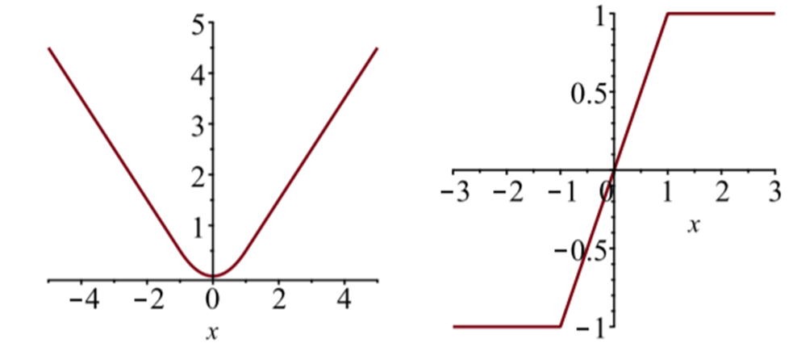

# 关于fasttext的keras实现及文本分类相关问题探讨

fasttext是facebook开发的一款快速文本分类的工具。工具本身有很多限制，比如只能做分类不能做回归问题，比如pooling的方式只能使用avg-pooling的方式，只能针对char级别进行embedding，无法提取训练好的embedding向量等等。

综合上述的原因，本篇在一个通过用户文本识别年龄的任务背景下，探讨通过keras实现一个fasttext工具，并且探究其中涉及到的一些机器学习，文本建模相关问题的分析。

**目录：**

**1) fasttext的基本原理**

**2) fasttext的简单实践**

**3) keras的fasttext实现**

**4) PAD的问题和MASK的意义**

**5) POOLING策略对比**

**6) 用fasttext-keras做回归的实验**

**7) 对embedding的分析**

## fasttext的基本原理

fastText简而言之，就是把文档中所有词通过lookup table映射为一个embedding向量，经过avg-pooling后直接经过1层全连接层得到分类结果。本质十分类似于一个BOW模型，但由于使用了词向量因此效果更好。同时由于使用pooling的方式因此对词序不敏感，仅通过n-gram的方式捕捉一定程度的context。


 


当然，如果只用unigram的话会丢掉word order信息，所以通过加入n-gram features进行补充。fastText是可以对char级别生成embedding的。(这里同bert不同，bert虽然是基于字做vocab，但是每个词的向量不是简单的将字embedding拼起来，而是需要完整经过bert模型前向运行得到，所以得到的词向量效果也非常好，然而fastText这种通过字向量加和成为词向量会极大受到字面匹配程度的干扰导致忽视了语义，一个经典的例子就是fasttext官方的中文词向量进行kNN计算，“交易”最接近的词是“交易法”，但gensim训练的词向量则是“买卖”)。

然而Fasttext的word_ngrams参数很大影响了效率，实测当词库比较大时，2-gram就会非常慢了(主要是保存模型特别慢，2-gram的参数非常多了)，而实际1-gram在多迭代几次后就能达到很好的效果，多数情况下没必要上2-gram。这个同文本分类任务的特性有关：刘至远提到像文本分类这样的任务，如果是长文本，即使用BOW也能做很不错的效果。另外项亮说到文本分类大部分情况下是个简单的线性问题，因为词汇本来就是高度凝结智慧和信息量的产物了，所以多层网络某些情况下没太多意义。
而我的理解是文本分类任务由于很多情况下不需要捕捉高级的语法关系，上下文语境等等，而只需要做词汇匹配就行。因此由于长文本下BOW不会太过稀疏，效果也会不错。

## fasttext的简单实践
facebook最早推出的是c++的版本，后续封装了python版本，实测python版本的运行效率也很高，因此本文采用的是fasttext的python版本。安装方式通过pip就能完成，我使用的是0.8.3版本，安装的时候需要加上版本号pip install fasttext==0.8.3，同时要求预先安装Cython。我们要做一个简单的分类任务，根据用户关注的文本来预测用户的年龄，简单的demo如下：
```python
import fasttext as ft

input_file = 'for_ft_age_pred_train'
test_file = 'for_ft_age_pred_test'
output = '/tmp/classifier_comm'

# set params
dim = 30
lr =0.02
epoch = 15
min_count = 1
word_ngrams = 1
bucket = 2000000
thread = 16
silent = 0
label_prefix = 'll'

# Train the classifier
print('Start Trainning...')
classifier = ft.supervised(input_file, output, dim=dim, lr=lr, epoch=epoch,
    min_count=min_count, word_ngrams=word_ngrams, bucket=bucket,
    thread=thread, silent=silent, label_prefix=label_prefix)

# Test the classifier
print('Start Test...')
result = classifier.test(test_file)
print ('P@1:', result.precision)
print ('R@1:', result.recall)
print ('Number of examples:', result.nexamples)
```

代码部分很简单，输入的训练测试用的文件格式按照fasttext要求的格式：

    ll22 猎手 通信软件 样子 吃饭 一度 面朝 语录 科技 蔓延 宠物 软件 数码 大中华 教练 排课 励志 学员 大学生 拓客 远见 尚凝 误事 困扰 回避 不多 微云 哈哈大笑 超赞 好感 强力 三门峡 友谊 法令 让路 牵线 私拍 闷骚 国产手机 当代 听歌 寻爱 个人 云彩 一章 听书 繼續 评测 投稿 在读
    ll42 猪扒 同事 餐饮 九朝会 眼镜 区块 猎豹 数字 研学 有助于 平均 状况 管理者 沦陷 主义 食品市场 image 嘉宴 com 多点 快人 财经 振兴 德鲁克 傅盛 ceo 音米 玲香 men 版权 金刚 新生 笔记 图像 版块 复购 生产力 信文 不接 打卡 空间设计 一味 乡村 形象店 爱马 小腰 合生汇 望京 停车 代驾 颠簸 文旅 田园 货币 数千万 邦德 紫牛 识堂 华少 绵密 混沌 川菜 奶泡 
    ll50 山海关区 报纸 订阅 家庭幸福 积极向上 钟表 手表 大脑 找房 思维 易高 街舞 偃师 吴家山 马鹦路 随时 宣传片 人情味 代言人 青睐 小儿 撒娇 武汉市 洛龙区 如沐春风 灯光效果 洛阳 河南 河南省 改灯 元享 家国 获得者 飞龙在天 珠海 哆啦宝 分拨 原厂 景辉 为入 全屋 集迦 瑞士 好望角 优物 泰克 报道 途径 瑞星 翔鹭 广仁堂 保利 蔡塘 江腾 东百 香槟 建业 陆港 菜单 淡淡的 宝时捷 poscer 实景图 设计奖 新闻频道 晒家 制表 拆检 vincent 午报 mas 作而 which 同气相求 云从龙 传等 众筹店 利见 风从虎 同声相应 gemplus 俄亥俄州 入藏 约翰斯顿 浅出 不浮 不躁 散发出 不卑不亢 上海牌 女座 特区报 何谓 护墙板 遍布全国

其中ll是标签的前缀，这是fasttext的格式要求，配合参数label_prefix定义前缀使用，后边跟的是标签，在我们的场景下是用户的年龄。再之后接的是标签对应的文本数据，需要注意这里需要预先完成分词，去除停用词等文本预处理操作，然后分词后的文本用空格分隔。（fasttext针对的英文文本天然就是这种形式）

再之后就是设定一些参数，其中embedding的维度dim我们设置为30，文本分类往往不需要很长的embedding，因为不需要太过于依赖深层的语义。然后是学习率lr，epoch为迭代轮数。min_count体现在对于冷门词的处理，对于在数据集中出现的词频低于min_count的部分，fasttext将用UNK来代替以避免词表的爆炸。然后word_ngrams很重要，对于不需要利用上下文的话就让word_ngrams=1,这样运行效率最高。一般不会让word_ngrams>3否则运行效率会非常低，并且得到的模型会非常巨大。

```markdown
Read 273M words
Number of words:  232273
Number of labels: 109
Progress: 100.0%  words/sec/thread: 1401274  lr: 0.000000  loss: 3.565652  eta: 0h0m 14m 
Start Test...
P@1: 0.12258363063695123
R@1: 0.12239581004504142
Number of examples: 334955
```
运行结果如上图，我们再直观测试一下同年龄相关的词汇看模型预测的怎么样：

```python
In [4]: classifier.predict_proba(['京剧'])
Out[4]: [[('77', 0.126953)]]

In [5]: classifier.predict_proba(['王者 荣耀'])
Out[5]: [[('14', 0.318359)]]

In [6]: classifier.predict_proba(['中年 危机'])
Out[6]: [[('45', 0.320313)]]

In [7]: classifier.predict_proba(['考研 大学'])
Out[7]: [[('24', 0.332031)]]
```

out部分的结果为[[预测年龄，概率]]，看起来效果还不错。另外fasttext是可以读取pre-train vec的，在ft.supervised()API里加上参数pretrained_vectors来读取一个预训练的词向量。这里我没有使用预训练的词向量，如果加上预训练词向量的效果可能更好一些。

fasttext实现简单，速度快。但正是其高度封装，缺乏定制能力导致有三个不足之处：

1） fasttext做文本分类的时候是用到词向量的，但是没有提供API能够提取输出这个词向量，这带来一些不便捷的地方。比如我想输出词向量做kNN计算来测试对于语义的表示能力。我们只能从保存的fasttext模型中一窥fasttext的词向量：


 


2） fasttext默认使用average-pooling作为pooling策略，然而这个策略十分简单，并且存在一些问题，却无法更改。
3）fasttext只能做分类，而在我们的任务里，分类并不一定是最优方案。预测年龄也可以当做一个回归问题。因为年龄是具有连续性的，做回归任务能让模型很容易的学到年龄的连续性，而分类任务上，一个label=29岁的样本，预测为27岁和预测为72岁的loss是一样的，这有点不太合理。

由于以上三点，我打算自己用keras写一个fasttext的实现，从而能够充分的定制化。

## keras的fasttext实现

第一版模型非常简单，使用keras的Sequential模型搭建方式：
```python
import tensorflow.contrib.keras as kr
from keras.models import Sequential 
from keras.layers import *
from collections import Counter
from keras import backend as K 
import pickle

VOCAB_SIZE=232620
EMB_DIM=80
MAX_WORDS=100 
CLASS_NUM=105

model = Sequential()

model.add(Embedding(VOCAB_SIZE,EMB_DIM,input_length=MAX_WORDS))
# pooling策略，max-pooling可换成GlobalMaxPooling1D()
model.add(GlobalAveragePooling1D())

model.add(Dense(30,activation='tanh'))

model.add(Dense(CLASS_NUM, activation='softmax'))
model.compile(loss='categorical_crossentropy',optimizer='Adam',metrics=['accuracy'])
```
这基本就是fasttext的结构，只是我们多加了一个denseLayer，而fasttext是只有一层denLayer的。当然这里要求的数据输入形式也发生了变化，我们需要自己做文本数值化，并且fit模型的时候label和data分两个numpy array输入。为了完成文本数值化需要先遍历数据集构建映射字典：
```python
wd_mapping = {
 '棉类': 80288,
 '心书阁': 228207,
 '大毛': 119492,
 '纤云书阁': 117564,
 '无赖': 84071,
 '通化': 230582,
 '铁友': 95631,
 '优农': 2043,
 '商丘站': 214523,
 '经过': 208361,
 '静乐县': 186418,
 ...}
```
通过上述wd_mapping，将文本数值化。这里需要注意一个问题，fasttext允许输入变长文本，但是我们写的keras版本默认只能接受定长的数据，因此需要将变长文本转为定长文本，此处常见的方法为truncate and pad。也就是设置一个sequence长度，将超过该长度的文本序列裁剪，将不足该长度的文本序列用padding符号补齐。该padding符号需要单独编码为一个数值，以便模型区分，这里我们将PAD符号编码为0。同时设置sequence长度为100。

由此得到特征矩阵X。同时把label标签数组age提取出来：

```python
In [18]: X.shape
Out[18]: (3964000, 100)

In [19]: X[:100]
Out[19]: 
array([[212707,  54498, 164469, ..., 120572, 156637,  77079],
       [ 81803, 199415,   9542, ..., 120313,  14277, 151248],
       [ 68675,  67283, 148842, ...,  45229,  44513, 103468],
       ...,
       [159667, 151749, 205562, ..., 206223, 212545,  91545],
       [125190, 149107, 141092, ..., 232619, 232619, 232619],
       [115429, 185167, 196507, ..., 115152, 144918, 200191]])
       
In [20]: age[:100]
Out[20]: 
array(['34', '32', '42', '32', '38', '34', '46', '34', '30', '35', '32',
       '24', '32', '33', '37', '50', '38', '36', '42', '32', '31', '36',
       '39', ...])
```

然后在我们的数据集上试一下：

```python
SPLIT_LINE = 3000000

ct = Counter(age)
W = np.array([1/np.sqrt(ct[i])*5 for i in age[:SPLIT_LINE]])

model.fit(X[:SPLIT_LINE], kr.utils.to_categorical(age[:SPLIT_LINE],CLASS_NUM), validation_data=(X[SPLIT_LINE:], kr.utils.to_categorical(age[SPLIT_LINE:],CLASS_NUM)), nb_epoch=1, batch_size=1024, sample_weight=W)
```

注意这里我们做了数据均衡处理，因为在我们的数据集中用户的年龄分布差距很大，高龄的用户样本非常稀少，因此通过提供一个sample_weight来使得类别不均衡的问题得到改善。关于是否需要做类别均衡，这个问题不能一概而论，我的经验是如果你需要照顾冷门类目的识别覆盖率，则需要做类别均衡，而如果只是在意预测大盘的整体准确率的话则没有必要做类别均衡处理。

```markdown
Train on 3000000 samples, validate on 928866 samples
Epoch 1/1
2020-02-08 11:22:08.395383: I tensorflow/core/platform/cpu_feature_guard.cc:140] Your CPU supports instructions that this TensorFlow binary was not compiled to use: SSE4.1 SSE4.2 AVX
2020-02-08 11:22:10.310209: I tensorflow/core/common_runtime/gpu/gpu_device.cc:1212] Found device 0 with properties: 
name: Tesla K20m major: 3 minor: 5 memoryClockRate(GHz): 0.7055
pciBusID: 0000:09:00.0
totalMemory: 2.00GiB freeMemory: 1.94GiB
2020-02-08 11:22:10.310287: I tensorflow/core/common_runtime/gpu/gpu_device.cc:1312] Adding visible gpu devices: 0
2020-02-08 11:22:12.636853: I tensorflow/core/common_runtime/gpu/gpu_device.cc:993] Creating TensorFlow device (/job:localhost/replica:0/task:0/device:GPU:0 with 1727 MB memory) -> physical GPU (device: 0, name: Tesla K20m, pci bus id: 0000:09:00.0, compute capability: 3.5)
3000000/3000000 [==============================] - 342s 114us/step - loss: 3.5083 - acc: 0.0959 - val_loss: 3.3296 - val_acc: 0.1122
```

训练好之后，测试一下效果。下边的to_id()函数功能是将文本数值化，然后topn函数的作用是返回预测结果的top3标签和概率：

```python
In [27]: np.apply_along_axis(topn, 1, model.predict(to_id('太极拳')), 3) 
Out[27]: 
array([[17.        , 18.        , 20.        ,  0.02589941,  0.02517441,
         0.02304856]])	 
In [28]: np.apply_along_axis(topn, 1, model.predict(to_id('太极拳 太极拳 太极拳 太极拳 太极拳 太极拳 太极拳 太极拳 太极拳')), 3) 
Out[28]: 
array([[61.        , 64.        , 17.        , 1.92667879e-02,
        1.70407854e-02, 1.66415088e-02]])
```

## PAD的问题和MASK的意义


经过对上边模型结果的测试，发现对于短文本的预测效果不太对，但是人为增长文本后效果又比较正常了，这是为什么呢？

注意到上边我们将短文本转化为定长的方式是使用PAD补齐，PAD符号作为编号0也有一个对应的embedding向量，那么可以试想一下对于短文本来说，average-pooling后的向量表达的几乎就是PAD向量了。虽然模型会学到PAD符号是无意义的，但是短文本本身的特点还是得不到充分表达。

延伸一些说，PAD的方式其实是广泛使用在一些深度神经网络相关的文本模型中，如CNN、RNN。但CNN和RNN的机制比pooling复杂的多，比如RNN可以通过门机制来减少PAD符号的影响，而pooling策略只是简单的对向量做了平均，所以短文本受到PAD的影响就会十分明显。

因此更优的处理应该是怎么样的呢？我们不希望模型去学习一个PAD符号对应的向量，考虑到使用的是average-pooling，因此我们希望直接将PAD符号对应的embedding直接置为全0[0,0,0,0...,0,0]，这样就不会产生任何影响了。那么如何在keras中实现这样一个功能呢？这就需要借助到MASK了。

MASK方式是因为最近大热的bert、transformer的出现而引人关注。一篇很好的文章在https://leemeng.tw/neural-machine-translation-with-transformer-and-tensorflow2.html 其中详细描述了transformer中mask的作用和实现方式。在 Transformer 裡頭有兩種 masks：padding mask和look ahead mask。前者就是我们需要的。

keras中提供了带mask的Embedding。介绍一下keras Embedding的mask_zero机制，经典的使用场景是在LSTM上，它不会return [0,..0] vec for symbol 0，相反，Embedding layer的参数是不受影响继续训练的，mask_zero只是给了一个mask给后续的layer用，所以后续layer没有使用mask的话是会报错的。keras官方文档的解释：mask_zero: 是否把 0 看作为一个应该被遮蔽的特殊的 "padding" 值。 这对于可变长的 循环神经网络层 十分有用。 如果设定为 True，那么接下来的所有层都必须支持 masking，否则就会抛出异常。 如果 mask_zero 为 True，作为结果，索引 0 就不能被用于词汇表中 （input_dim 应该与 vocabulary + 1 大小相同）。

综上，我们需要自定义一个average-pooling layer来接受mask的传参并进行处理：

```python
from keras import backend as K
from keras.engine.topology import Layer

class MyMeanPool(Layer):
    def __init__(self, axis, **kwargs):
        self.supports_masking = True
        self.axis = axis
        super(MyMeanPool, self).__init__(**kwargs)

    def compute_mask(self, input, input_mask=None):
        # need not to pass the mask to next layers
        return None

    def call(self, x, mask=None):
        if mask is not None:
            mask = K.repeat(mask, x.shape[-1])
            mask = tf.transpose(mask, [0,2,1])
            mask = K.cast(mask, K.floatx())
            x = x * mask
            return K.sum(x, axis=self.axis) / K.sum(mask, axis=self.axis)
        else:
            return K.mean(x, axis=self.axis)

    def compute_output_shape(self, input_shape):
        output_shape = []
        for i in range(len(input_shape)):
            if i!=self.axis:
                output_shape.append(input_shape[i])
        return tuple(output_shape)
```

上边是一个典型的keras自定义layer的方法，继承keras的Layer类，然后复写call()方法来实现该层的距离逻辑，注意此处传参多了一个mask，这里的mask来自于上边Embedding Layer的mask，mask的shape同input sequence length相同，它会对编号0的部分mask置位为0，其余置为1。所以我们直接通过x = x * mask，将PAD符号对应的embedding置为全0向量。

插一句题外话，除了上边这种自定义Layer的方法，tf还提供了lambda layer可以只需添加一个lambda表达式作为逻辑，比如keras.layers.Lambda(lambda wide: wide**2)，这个对于大多数简单逻辑更方便，毕竟很多自定义Layer的本质就只需要改写call()而已。附上一个condition_dropout的写法：
input_cond_drop = keras.layers.Lambda(lambda x: K.switch(K.tf.count_nonzero(x)>5,Dropout(0.5)(x),x))(input)

然后我们将代码稍作修改：

```python
model = Sequential()

model.add(Embedding(VOCAB_SIZE,EMB_DIM,input_length=MAX_WORDS,mask_zero=True))
model.add(MyMeanPool(axis=1))
model.add(Dense(30,activation='tanh'))

model.add(Dense(CLASS_NUM, activation='softmax'))
model.compile(loss='categorical_crossentropy',optimizer='Adam',metrics=['accuracy'])
```

然后我们再来验证一下是否生效，方法很简单，我们将不同长度的相同文本输入，看输出的结果是否一致：

```python
#未使用MASK
In [30]: np.apply_along_axis(topn, 1, model.predict(to_id('皱纹')), 3) 
Out[30]: 
array([[18.        , 17.        , 20.        ,  0.0279202 ,  0.02749163,
         0.02700286]])

In [31]: np.apply_along_axis(topn, 1, model.predict(to_id('皱纹 皱纹 皱纹 皱纹')), 3) 
Out[31]: 
array([[18.        , 20.        , 17.        ,  0.02260662,  0.02230301,
         0.02202889]])
	 
#使用MASK
In [30]: np.apply_along_axis(topn, 1, model.predict(to_id('皱纹')), 3) 
Out[30]: 
array([[56.        , 55.        , 54.        ,  0.07423874 ,  0.06830128,
         0.057345204]])

In [31]: np.apply_along_axis(topn, 1, model.predict(to_id('皱纹 皱纹 皱纹 皱纹')), 3) 
Out[31]: 
array([[56.        , 55.        , 54.        ,  0.07423874 ,  0.06830128,
         0.057345204]])
```

可以看到未使用MASK的版本，虽然同样的词汇，不同长度预测的结果不同，就是因为PAD的embedding也参与计算了。而下边使用MASK的版本相同的词汇不管长度多长，结果都是一样的，因为参与average-pooling的都是同一个词汇。
另外也能看到下边使用MASK的版本对于预测短文本的效果好了不少。

我们也可以从一些相关文章中找到一致的看法： 

This can actually cause a fairly substantial fluctuation in performance in some networks. Suppose that instead of a convnet, we feed the embeddings to a deep averaging network. Then the varying number of nonzero pad vectors (according to which training batch the example is assigned in SGD) will very much affect the value of the average embedding. I've seen this cause a variation of up to 3% accuracy on text classification tasks. **One possible remedy is to set the value of the embedding for the pad index to zero explicitly between each backprop step during training.** This is computationally kind of wasteful (and also requires explicitly feeding the number of nonzero embeddings in each sample to the network), but it does the trick. I would like to see a feature like Torch's LookupTableMaskZero as well.

上边提到实在不行就每次将padding emb强制设置为0，否则用mask是最好的。另外hanxiao在pooling的设计介绍中也提到：

I say almost, as one has to be careful with the padded symbols when dealing with a batch of sequences of different lengths. **Those paddings should never be involved in the calculation.** Tiny details, yet people often forget about them.


## POOLING策略对比

用MASK解决了PAD引入噪声的问题，然而又出现了新的问题，加了MASK之后我发现结果对于长文本的分类准确度会下降，并且置信度也普遍偏低：

```python
In [29]: np.apply_along_axis(topn, 1, model.predict(to_id('皱纹')), 3) 
Out[29]: 
array([[56.        , 55.        , 54.        ,  0.07423874 ,  0.06830128,
         0.057345204]])
	 
In [30]: np.apply_along_axis(topn, 1, model.predict(to_id('皱纹 心事 聊聊 好玩 好歌 老歌 总能 事儿 夫妻')), 3) 
Out[30]: 
array([[56.        , 54.        , 20.        ,  0.0279202 ,  0.02749163,
         0.02700286]])

In [31]: np.apply_along_axis(topn, 1, model.predict(to_id('皱纹 心事 聊聊 好玩 好歌 老歌 总能 事
    ...: 儿 夫妻 经典 人生 在线 资讯 合作 本地 慰藉 诉说 之间 一些 技巧 感悟 商务 请点 家庭
    ...:  吉林 幸福 怡然自得 随遇而安 点击 按钮 免费听 阅读 夜深 顺其自然 新鲜事 下方 关注 聊以 太极拳')), 3) 
Out[31]: 
array([[18.        , 20.        , 17.        ,  0.02260662,  0.02230301,
         0.02202889]])
```       
这是一个比较现实的问题，从人的角度看，上边的长文本虽然包含了不少噪声（这是数据来源的性质决定的），但是其实提供了更多信息量来证明这是一个老年用户，比如：皱纹、老歌、怡然自得、随遇而安、顺其自然、太极拳。相反短文本仅仅包含一个词汇反倒显得不那么确定。这是因为这里噪声并不影响人的判断，我们能够分辨出这其中很多词都是噪声词，并不能反映出用户的年龄，但是目前的模型却对长文本的分类效果不佳。

这里的原因是在于我们采取的average-pooling导致的。还记得上文我们提到过average-pooling的缺点，当文本非常长时，经过average-pooling后得到的embedding会失去特点，并且容易受到噪声的干扰。而看起来这一点换成max-pooling则不会出现，因为只要词汇的“个性”够突出，无论多长的文本max-pooling都能体现出该词汇。

而恰恰不好的一点在于我们的数据集中噪声词非常多，很多词汇完全看不出跟用户的年龄的关系。在这种情况下使用average-pooling不仅仅是长文本置信度低了，而是可能根本就预测不准。

于是为了探寻解决方法，我们将average-pooling换成max-pooling看看。如果不考虑MASK的话，那么只要GlobalAveragePooling1D()换成GlobalMaxPooling1D())
就行了，但这里棘手的问题在于由于MASK的方案需要保持，所以还是需要自定义一个能够处理mask的max-pooling layer。并且这个带mask的max-pooling layer的设计会复杂一些。由于是要取max，那么为了让PAD符号对应的向量不产生的影响，应该将这个向量转变为一个最负的向量，这样取max操作时才不会有影响：

```python
class MyMaxPool(Layer):
    def __init__(self, axis, **kwargs):
        self.supports_masking = True
        self.axis = axis
        super(MyMaxPool, self).__init__(**kwargs)

    def compute_mask(self, input, input_mask=None):
        # need not to pass the mask to next layers
        return None

    def call(self, x, mask=None):
        if mask is not None:
            mask = K.repeat(mask, x.shape[-1])
            mask = tf.transpose(mask, [0,2,1])
            mask = K.cast(mask, K.floatx())
            x = x + (mask-tf.ones_like(mask))
            return K.max(x, axis=self.axis)# / K.sum(mask, axis=self.axis)
        else:
            return K.max(x, axis=self.axis)

    def compute_output_shape(self, input_shape):
        output_shape = []
        for i in range(len(input_shape)):
            if i!=self.axis:
                output_shape.append(input_shape[i])
        return tuple(output_shape)

model = Sequential()

model.add(Embedding(VOCAB_SIZE,EMB_DIM,input_length=MAX_WORDS,mask_zero=True))
model.add(MyMaxPool(axis=1))
model.add(Dense(30,activation='tanh'))

model.add(Dense(CLASS_NUM, activation='softmax'))
model.compile(loss='categorical_crossentropy',optimizer='Adam',metrics=['accuracy'])
```

写好后测试一下，这回如我们上边分析的那样，长文本分类效果不佳的问题改善了，但是短文本分类效果却又变差了。：(

```python
In [9]: np.apply_along_axis(topn, 1, model.predict(to_id('太极拳')), 3)
Out[9]: 
array([[13.        , 27.        , 14.        ,  0.07882072,  0.07579017,
         0.07078231]])

In [10]: np.apply_along_axis(topn, 1, model.predict(to_id('心事 聊聊 好玩 老歌 总能 事
    ...: 儿 夫妻 经典 人生 在线 资讯 合作 本地 慰藉 诉说 之间 一些 技巧 感悟 商务 请点 家庭
    ...:  吉林 幸福 点击 按钮 免费听 阅读 夜深 新鲜事 下方 关注 聊以 太极拳')), 3)
Out[10]: 
array([[53.        , 55.        , 56.        , 4.96205091e-02,
        4.73697968e-02, 4.54674773e-02]])
```
而从整体准确率上看，max-pooling跟average-pooling相比很接近:

```markdown
#max-pooling
Epoch 1/1
3000000/3000000 [==============================] - 342s 114us/step - loss: 3.5083 - acc: 0.0959 - val_loss: 3.3296 - val_acc: 0.1122
#average-pooling
Epoch 1/1
3000000/3000000 [==============================] - 444s 148us/step - loss: 3.5339 - acc: 0.0981 - val_loss: 3.3544 - val_acc: 0.1137
```

为什么max-pooling对于短文本的分类效果不佳，我发现一个可能的原因是因为短文本没有参与训练导致的。
首先我们来看一下max-pooling后的具体向量，为此我们需要定义一个tmp model，让这个model的输出是max-pooling的那一层：

```python
emb_layer_model = Model(inputs=model.input,outputs=model.get_layer(index=2).output)
```

注意这里get_layer()可以传参layer的名字，但如果没有预先对layer命名，则也可以使用index来获取。然后我们测试一下：

```python
In [4]: emb_layer_model.predict(to_id('太极拳'))
Out[4]: 
array([[ 0.00411378,  0.02985007,  0.39897776, -0.02118884, -0.04023433, -0.01045674, -0.02611212, -0.03361247, -0.04632258, -0.00930504,
        -0.04356932, -0.00906598,  0.02079267,  0.03696288, -0.04321554, -0.01118166, -0.00949513, -0.03085157, -0.02781947, -0.0014795 ,
        -0.02277656,  0.01075093, -0.03669649, -0.03871207,  0.00433551, -0.03904093, -0.004863  , -0.01867863, -0.00499802,  0.00452297,
        -0.0056574 , -0.0493666 , -0.03608467, -0.02040489,  0.01733131, 0.00086891, -0.00761601,  0.03622968, -0.01742102,  0.03993084,
        -0.01670716, -0.00638489,  0.00725468, -0.00960915, -0.0360944 , 0.00292842,  0.01920136, -0.02564749, -0.04372119, -0.04738882,
         0.01549867,  0.03010046, -0.03153356, -0.00710761, -0.02982652, -0.00222248, -0.02718726,  0.00635384, -0.04861099, -0.02790399,
         0.09577966,  0.00911651,  0.01458081, -0.01896752, -0.02847507, 0.03194983, -0.01203427,  0.03411033, -0.03102063, -0.00415487,
        -0.00344004, -0.00136711,  0.01951766, -0.02774856,  0.00158477, 0.01397388, -0.03469232, -0.0440844 ,  0.00150994, -0.0190758 ]],dtype=float32)
      
In [5]: emb_layer_model.predict(to_id('太极拳 人生 在线 咨询'))
Out[5]: 
array([[ 0.07358195,  0.25642893,  0.39897776,  0.10491236,  0.07971733, -0.01045674,  0.073511  , -0.03361247,  0.04126561,  0.09291146,
         0.07977773, -0.00906598,  0.18526706,  0.1085792 , -0.00488511, 0.07975443,  0.04338572,  0.08410247,  0.18150304,  0.20029144,
        -0.02277656,  0.07581803, -0.03669649,  0.1542539 ,  0.11336035, 0.13504203,  0.10231046, -0.00648652,  0.17089131,  0.00452297,
        -0.0056574 ,  0.07216299,  0.0323167 ,  0.13004397,  0.25307193, 0.08727699,  0.08395156,  0.22572361, -0.01742102,  0.03993084,
         0.05109052,  0.03796509,  0.00725468,  0.26877084,  0.02174886, 0.13312404,  0.0350004 , -0.02564749,  0.0195907 , -0.02202873,
         0.03255858,  0.07500413, -0.03153356,  0.00488822, -0.0223526 , -0.00222248,  0.0217955 ,  0.00635384,  0.20384946,  0.18904777,
         0.09577966,  0.00911651,  0.01458081,  0.16419487, -0.02176988, 0.03194983,  0.03179408,  0.24155124,  0.02463096, -0.00415487,
        -0.00344004,  0.28604078,  0.10116248,  0.07580757,  0.03161616, 0.16214813,  0.18776712, -0.03032799,  0.10442994,  0.22115743]],dtype=float32)

In [6]: emb_layer_model.predict(to_id('太极拳 人生 在线 咨询 夫妻 经典 心事 聊聊 好玩 好歌'
   ...: ))
Out[6]: 
array([[ 0.16801895,  0.4502973 ,  0.39897776,  0.10491236,  0.23625815, -0.00492539,  0.073511  ,  0.05413877,  0.07538925,  0.24753878,
         0.16166054,  0.19583893,  0.18526706,  0.1085792 ,  0.08003937, 0.45135164,  0.04338572,  0.08410247,  0.21805607,  0.25973535,
         0.04592014,  0.07581803, -0.02530586,  0.1542539 ,  0.12967815, 0.13504203,  0.14022031, -0.00648652,  0.17089131,  0.04840105,
         0.05795934,  0.07216299,  0.0323167 ,  0.13004397,  0.25307193, 0.08727699,  0.08678968,  0.22572361,  0.01462927,  0.07570589,
         0.16234207,  0.04609334,  0.00725468,  0.26877084,  0.02174886, 0.13312404,  0.0350004 ,  0.04644953,  0.02112084,  0.13359751,
         0.18690771,  0.07500413,  0.12772278,  0.05048437,  0.16239212, 0.15357374,  0.07534593,  0.11559007,  0.20384946,  0.18904777,
         0.09577966,  0.0346946 ,  0.01458081,  0.16419487,  0.08652248, 0.04348852,  0.04436128,  0.24155124,  0.08992527,  0.25197044,
        -0.00344004,  0.28604078,  0.10116248,  0.07580757,  0.09132104, 0.16214813,  0.18776712,  0.21126825,  0.10442994,  0.22115743]],dtype=float32)
```
可以看到取max-pooling，因此随着文本长度的增加，max-pooling后的embedding的正向量比例越来越高。

而由于我的训练样本中绝大部分都是长文本，因此模型接触到的max-pooling后的embedding很少有负值，然而短文本的pooling结果中大量都是负值，这对于模型来说是很陌生的，因此分类效果并不好。
当然这还只是停留在分析层面，最好的方式需要增加短文本的样本来测试模型是否改善，然而由于样本的限制目前还难以开展，后续有进展了再同步。

除此之外，我发现另外一个max-pooling很大的问题在于每轮只能更新max的embedding，也就意味着每轮只有极少量的embedding能得到更新，这导致如果不使用pre-train的wordVec的话训练收敛的速度会比较慢。而相比之前average-pooling每轮迭代所有的embedding都能参与更新。也许这就是为什么fasttext采用average-pooling的原因？

查阅了一下资料，Stackoverflow上有个我想问的问题，tf.max/min能否对多个value同时计算梯度并更新？ https://github.com/tensorflow/tensorflow/issues/16028。 里边提到可能需要自定义gradient计算函数，因为tf会对所有定义好的op提供默认的梯度计算方法，比如官方对于tf.max操作的梯度计算是这样的：

```python
def _MinOrMaxGrad(op, grad):
  """Gradient for Min or Max. Amazingly it's precisely the same code."""
  input_shape = array_ops.shape(op.inputs[0])
  output_shape_kept_dims = math_ops.reduced_shape(input_shape, op.inputs[1])
  y = op.outputs[0]
  y = array_ops.reshape(y, output_shape_kept_dims)
  grad = array_ops.reshape(grad, output_shape_kept_dims)

  # Compute the number of selected (maximum or minimum) elements in each
  # reduction dimension. If there are multiple minimum or maximum elements
  # then the gradient will be divided between them.
  indicators = math_ops.cast(math_ops.equal(y, op.inputs[0]), grad.dtype)
  num_selected = array_ops.reshape(
      math_ops.reduce_sum(indicators, op.inputs[1]),
      output_shape_kept_dims)

  return [math_ops.div(indicators, num_selected) * grad, None]
```

可以看到明确说如果tf.max有多个same max值，那么会把梯度平均分给这几个value。否则就只有max值所在的embedding会得到梯度并更新。

有两种方法改善tf.max的梯度影响范围，一种是自定义gradient计算函数，另一种是”softening” the max function，比如有人提到可以不取max，而是按照大小先排序，然后对这个排序进行加权求和，从而使得所有的值都能够参与到运算中去。另外还有人提到将max function改成Lp-norm：

```markdown
The concept of Lp-norm seems to me like a natural approach for "softening" the max function. For your two number case, the Lp-norm is defined as
y = (|a|^p + |b|^p)^(1/p)
where p is a free parameter.

The case p->∞ corresponds to
y = tf.maximum(a,b)
and the case p=2 corresponds to the familiar Eucledian distance. Perhaps there could be an intermediate p value which would suit your use case.
```

前者实现比较复杂，需要更改tensorflow自带的梯度计算函数。于是我按照第二个方案实现了一个Lp-norm-pooling：

```python
def call(self, x, mask=None):
    if mask is not None:
        mask = K.repeat(mask, x.shape[-1])
        mask = tf.transpose(mask, [0,2,1])
        mask = K.cast(mask, K.floatx())
        x = x * mask
        return (K.sum(x**2, axis=self.axis) / K.sum(mask, axis=self.axis)) ** 0.5
    else:
        return (K.sum(x**2, axis=self.axis) / K.sum(mask, axis=self.axis)) ** 0.5
```

这里超参数选p=2的就是最常见的L2-norm，p越大则Lp-norm就越近似于max-pooling的效果。但实际发现当p比较大的时候无法收敛，debug后发现是因为数值上溢，当p>=10就会出现数值上溢。
另外一点，即使是L2-norm在训练过程中网络也很容易发散，看起来不是一个太好的pooling策略。

另外换一种方式验证，我使用avg-pooling训练一版emb做为max-pooling的pre-train embedding，效果明显好多了，并且能够继续优化而不只是停滞于pre-train emb的效果，说明max-pooling是能够优化的，只是效率相对较低。


当然，最后采用的做法还是ensemble的思路，如果两种方法各有千秋那么就都一起用，于是最后的方式是同时使用max-pooling和average-pooling，将它们的结果concat起来：

```python
input = Input(shape=(MAX_WORDS,), name='input')
emb = Embedding(VOCAB_SIZE,EMB_DIM,input_length=MAX_WORDS,mask_zero=True)(input)

p1 =  MyMeanPool(axis=1)(emb)
p2 =  MyMaxPool(axis=1)(emb)

mer = concatenate([p1,p2])
den = Dense(30, activation='tanh')(mer)
out = Dense(CLASS_NUM, activation='softmax')(den)

modelC = Model(inputs=[input], outputs=[out])
modelC.compile(loss='categorical_crossentropy',optimizer='Adam',metrics=['accuracy'])
```
需要注意的是由于我们之前用的是keras的Sequential序贯模型的写法，该写法虽然简单但是不支持一些复杂的设计，比如接收多输入的Layer。而此处我们需要一个concatenate()操作，因此将写法改成了函数式模型的写法。

最后总结一下max-pooling和avearage-pooling各自的优缺点。

average-pooling的问题在于容易受到噪声干扰，对长文本pooling后无法体现出差异化。优点则是训练收敛速度快，所有参与pooling的向量都能够得到更新。

max-pooling的优缺点跟average-pooling基本相反，缺点是全局的max-pooling只有max部分的向量能够更新，因此训练过程收敛速度慢(可以使用pre-train embedding来缓解这个问题)。优点则是不太容易受到噪声干扰，并且对长文本的表达效果比较理想。另外max-pooling的emb_size不能太小，否则很多词汇根本没机会得到表达。 

因此可以考虑结合average-pooling和max-pooling一起使用，max-pooling最好不要在全局范围做，参考CNN的pooling layer只是在2*2的格子中做max-pooling因此不会丧失太多信息。所以延伸出一些hierarchical pooling的策略：先在局部窗口内做max-pooling，最后在全局范围内做average-pooling，这些都是可以参考的做法。

## 用fasttext-keras做回归的实验

上边我们提到过，关于预测年龄究竟应该做分类还是回归模型？现在我们用keras实现了fasttext，可以很容易的做一个回归实验来对比看看：

```python
input = Input(shape=(MAX_WORDS,), name='input')
emb = Embedding(VOCAB_SIZE,EMB_DIM,input_length=MAX_WORDS,mask_zero=True)(input)

p1 =  MyMeanPool(axis=1)(emb)
p2 =  MyMaxPool(axis=1)(emb)

mer = concatenate([p1,p2])
den = Dense(30, activation='tanh')(mer)
out = Dense(1, activation='linear')(den)

model=Model(inputs=[wide], outputs=[out])
model.compile(optimizer='Adagrad', loss='mse', metrics=['mse'])

model.fit(X[:3000000], np.array(age[:3000000])[:,np.newaxis], validation_data=(X[3000000:], np.array(age[3000000:])[:,np.newaxis]), nb_epoch=3, batch_size=1024)
```
只需要把模型的最后一层denseLayer的输出改为1，选线性激活函数。然后将loss换成MSE，也就是均方误差。最后label不需要做one-hot编码了，直接作为target就可以。

然而实测regression模型的效果并不理想，不如分类模型更有效：

```python
Train on 3000000 samples, validate on 928866 samples
Epoch 1/3
3000000/3000000 [==============================] - 424s 141us/step - loss: 0.2108 - mean_squared_error: 351.6949 - val_loss: 226.8362 - val_mean_squared_error: 226.8362
Epoch 2/3
3000000/3000000 [==============================] - 439s 146us/step - loss: 0.1569 - mean_squared_error: 200.2703 - val_loss: 180.0601 - val_mean_squared_error: 180.0601
Epoch 3/3
3000000/3000000 [==============================] - 445s 148us/step - loss: 0.1370 - mean_squared_error: 183.0301 - val_loss: 180.6361 - val_mean_squared_error: 180.6361

In [119]: model.predict(to_id('王者 荣耀'))
Out[119]: array([[27.257313]], dtype=float32)

In [120]: model.predict(to_id('辅导班'))
Out[120]: array([[29.845041]], dtype=float32)

In [121]: model.predict(to_id('毛泽东思想'))
Out[121]: array([[35.36142]], dtype=float32)

In [122]: model.predict(to_id('京剧'))
Out[122]: array([[35.35544]], dtype=float32)
```

可以看到预测结果基本都在一个小范围内，对不同年龄段的词汇能反映出一些正确的差异性，但这个差异很小导致整体预测结果不好。

为什么会造成这个结果？对于regression效果不好的问题，我认为一定程度是因为mse这个loss造成的，l2 loss的好处是收敛快，但是对离群值很敏感，举例而言。对于一个年龄为30岁的用户，如果预测为31岁那么loss是(31-60)^2=1,然而如果预测为60岁那么loss是(60-30)^2=900,两者相差了900倍，这个判错的代价是很大的。再加上我们数据labe分布的不均衡，大量用户都分布在20-40岁之间，导致了模型从loss最小化的角度出发预测结果只能非常保守的留在这个区间。当然我是做了sample加权来缓解了label分布不均匀的问题，但是mse loss对于label不均匀的敏感程度要比分类问题高很多。

还是上边同样的问题如果做分类模型，预测为30岁与预测为60岁的loss是差不多的,因为loss的来源都是从30岁的softmax归一化概率决定的。

考虑到上边的情况，似乎使用L1 loss代替MSE是一种选择。L1 loss相比MSE不会对差异那么敏感。对上边的例子预测为60岁的loss是30，是预测为31岁的30倍，相比900倍要缓和很多。
而在工程上，相比之下smoothL1Loss是一种更优的选择。注意smooth L1和L1-loss函数的区别在于，L1-loss在0点处导数不唯一，可能影响收敛。smooth L1的解决办法是在0点附近使用平方函数使得它更加平滑，如左图，所以右图对其求导不会有跳变点：


 
 
由于keras自带的loss中并没有包含smooth l1-loss，因此此处需要涉及到自定义loss函数，方法也比较简单，我们自己定义一个函数接收y_true,y_pred两个入参，然后自定义计算loss的方法。最后在model.compile()中将自定义loss函数名作为入参传进去就可以：

```python
HUBER_DELTA = 0.5
def smoothL1(y_true, y_pred):
   x   = K.abs(y_true - y_pred)
   x   = K.switch(x < HUBER_DELTA, 0.5 * x ** 2, HUBER_DELTA * (x - 0.5 * HUBER_DELTA))
   return  K.sum(x)

model.compile(optimizer='Adagrad', loss=smoothL1, metrics=['mse'])
```

然而换成了smooth L1 loss改善仍然不太明显，我认为可能的原因：

1）regression可能不合适该场景，regression适用于feats x同y有正负相关性的，所以regression的例子很少最有名的就是house price prediction。而对于text prediction，词向量同y是没有线性关系的，会对regression效果有影响。

2）smooth L1 loss只能缓解L2-loss受到类别不均衡的影响，缓解对数值差异的敏感程度，依然比较容易受到离群值，噪声值的影响。考虑到我们数据集质量本身就不是很高，造成的影响会更大。

3）regression还有一些别的问题，比如MSE loss对于大值是有偏的(mean squared logarithmic error能够缓解)。另外regression只能输出一个预测值，而classification是能够输出所有类别的概率分布的，相比之下后者输出了更多信息，比如我们可以使用top3 accuracy进行评估，可以了解到所有年龄值的预测概率。

## 对embedding的分析

```markdown
60岁老年人关键词：
下边,京剧,重燃,小提琴曲,好山好水,像册,戏友,越剧,小提琴,爱己,揭晓,取胜,几秒钟,一切照旧,小妙,听桐,万变不离其宗,指挥部,整体观,知青,退休,二胡,老伴,企退,静观,淡泊,敢评,水波,花友,万企退,就学,调阅,器诫,万分钟,不解之谜,听歌曲,凝固,倒影,收纳,老同志,有妙,提高警惕,百晓生


45岁中年人关键词：
社会各界,代表性,情思,深渊,故乡情,千聊,龙门石窟,改制,大人物,锐意进取,大盘,碱性,晒出,识遍,书信,西城,犀牛,衰老,在座,何氏,会触,千秋,十一,活法,色香味,再生资源,必知,神话,香肠,清辉,书多,ufc,发誓,部长,万元,佛光山,条无,听懂,座右铭,共舞

20岁青年人关键词：
研制,保修,大中专,自考办,心理健康,教育工作者,一程,月租,财政,美楠,稚粉,招考办,超星,工作部,稳重,秀米,公演,介意,不安分,aj,直降,网课,嗡嗡,开水,安卓端,掌桂是,汽修,背心,中有,省委,法学院,普通本科,高至,易班,上售,成考,新增,一共,华中师范大学,兰可欣,lanktom,校区
```
待续
