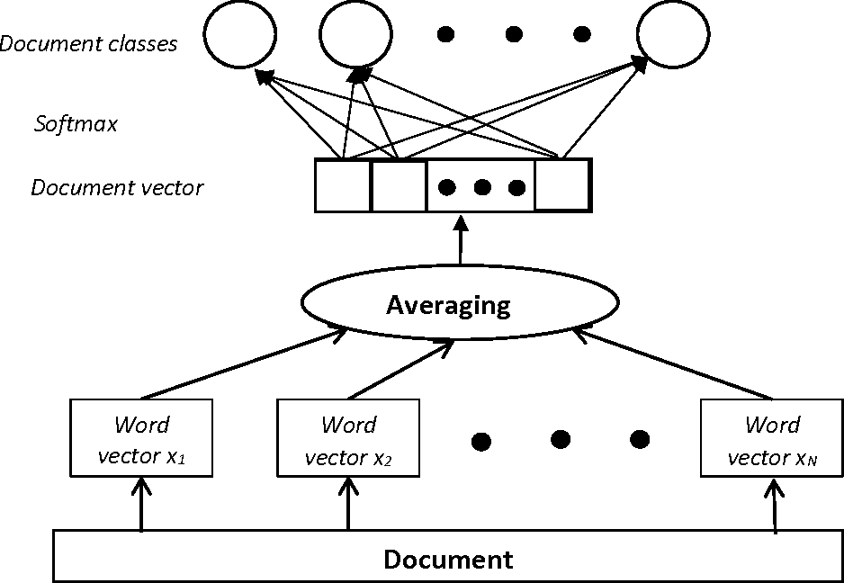
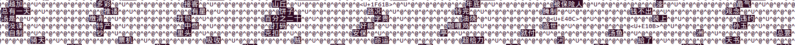

## 关于fasttext的keras实现以及相关问题探讨

fasttext是facebook开发的一款快速文本分类的工具。工具本身有很多限制，比如只能做分类不能做回归问题，比如pooling的方式只能使用avg-pooling的方式，只能针对char级别进行embedding，无法提取训练好的embedding向量等等。
综合上述的原因，本篇探讨通过keras实现一个fasttext工具，并且探究其中涉及到的一些机器学习，文本建模相关问题的分析。

### fasttext的基本原理

fastText简而言之，就是把文档中所有词通过lookup table映射为一个embedding向量，经过avg-pooling后直接经过2层全连接层得到分类结果。本质十分类似于一个BOW模型，但由于使用了词向量因此效果更好。同时由于使用pooling的方式因此对词序不敏感，仅通过n-gram的方式捕捉一定程度的context。


 


当然，如果只用unigram的话会丢掉word order信息，所以通过加入n-gram features进行补充。fastText是对char级别生成embedding的。(这里同bert不同，bert虽然是基于字做vocab，但是每个词的向量不是简单的将字emb拼起来，而是需要完整经过bert模型前向运行得到，所以得到的词向量效果也非常好，然而fastText这种通过字向量加和成为词向量那肯定是不行的，会极大受到字面匹配程度的干扰，一个经典的例子就是fasttext得到的词向量进行kNN计算，“交易”最接近的词是“交易法”，但gensim训练的词向量则是“买卖”)。

然而Fasttext的word_ngrams参数很大影响了效率，实测当词库比较大的话如果2-gram就会非常慢了(主要是保存模型特别慢，2-gram的参数非常多了)，而实际1-gram在多迭代几次后就能达到很好的效果，多数情况下没必要上2-gram。这个同文本分类任务的特性有关：刘至远提到像文本分类这样的任务，如果是长文本，即使用BOW也能做很不错的效果。另外项亮说到文本分类大部分情况下是个简单的线性问题，因为词汇本来就是高度凝结智慧和信息量的产物了，所以多层网络没太多意义。
我的理解是文本分类任务由于很多情况下对不需要捕捉高级的语法关系，上下文语境等等，而只需要做词汇匹配就行。因此长文本下BOW不会太过稀疏，效果也会不错。

### fasttext的简单实践
facebook最早推出的是c++的版本，后续封装了python版本，实测python版本的运行效率也很高，因此本文采用的是fasttext的python版本。安装方式通过pip就能完成，我使用的是0.8.3版本，安装的时候需要加上版本号pip install fasttext==0.8.3，同时要求预先安装Cython。我们要做一个简单的分类任务，根据用户关注的文本来预测用户的年龄，简单的demo如下：
```python
import fasttext as ft

input_file = 'for_tgrocery_age_preda_train'
test_file = 'for_tgrocery_age_preda_test'
output = '/tmp/classifier_comm'

# set params
dim= 30
lr=0.02
epoch= 15
min_count= 1
word_ngrams= 2
bucket= 2000000
thread= 16
silent= 0
label_prefix= 'll'

# Train the classifier
print('Start Trainning...')
classifier = ft.supervised(input_file, output, dim=dim, lr=lr, epoch=epoch,
    min_count=min_count, word_ngrams=word_ngrams, bucket=bucket,
    thread=thread, silent=silent, label_prefix=label_prefix)

# Test the classifier
print('Start Test...')
result = classifier.test(test_file)
print ('P@1:', result.precision)
print ('R@1:', result.recall)
print ('Number of examples:', result.nexamples)
```

代码部分很简单，输入的训练测试用的文件格式按照fasttext要求的格式：

    ll32 迅游 编程 老爷 输送 回到 中国农业银行 北京分行 信息安全 小爱 火绒 高速 安防 后勤 人才 安全 驾驶 超悦 永信 在线教育 守望 少儿 智能 微云 庄稼 益安 cn 悦茂 联赛 酒家 长亭 东升 web 哈勃 精神状态 千聊 中国青少年发展基金会 rainbow 小米 兰州 望远镜 水果 运维 转回 花童 美团 香里 姥姥家 平谷 果多美 北京 车车 开放 大巴 路况 春秋 石屋 网络安全 大侠 百行 客官 查导 榉树 合乘 吱车 婚姻登记 驾驶者 为青 vipjr itutorgroup 企业级 前沿技术 hubble netman 其子 普世化 pwnhub 应用层 telescope 护网杯 微油 电踏车 店查 尧西 origin 上助家 导及 桃叶谷 宇宙空间 及乐 火方 升空 黄栌 如履薄冰 乐乘 若隐若现 处室 此圈 看雪 控管 婚俗
    ll42 猪扒 同事 餐饮 九朝会 眼镜 区块 猎豹 数字 研学 有助于 平均 状况 管理者 沦陷 主义 食品市场 image 嘉宴 com 多点 快人 财经 振兴 德鲁克 傅盛 ceo 音米 玲香 men 版权 金刚 新生 笔记 图像 版块 复购 生产力 信文 不接 打卡 空间设计 一味 乡村 形象店 爱马 小腰 合生汇 望京 停车 代驾 颠簸 文旅 田园 货币 数千万 邦德 紫牛 识堂 华少 绵密 混沌 川菜 奶泡 

其中ll是标签的前缀，这是fasttext的格式要求，配合参数label_prefix定义前缀使用，后边跟的是标签，在我们的场景下是用户的年龄。再之后接的是标签对应的文本数据，需要注意这里需要预先完成分词，去除停用词等文本预处理操作，然后分词后的文本用空格分隔。（fasttext针对的英文文本天然就是这种形式）

再之后就是设定一些参数，其中embedding的维度dim我们设置为30，文本分类往往不需要很长的embedding，因为不需要太过于依赖深层的语义。然后是学习率lr，epoch为迭代轮数。min_count体现在对于冷门词的处理，对于在数据集中出现的词频低于min_count的部分，fasttext将用UNK来代替以避免词表的爆炸。然后word_ngrams很重要，对于不需要利用上下文的话就让word_ngrams=1,这样运行效率最高。一般不会让word_ngrams>3否则运行效率会非常低，并且得到的模型会非常巨大。

```markdown
Read 273M words
Number of words:  232273
Number of labels: 109
Progress: 100.0%  words/sec/thread: 1401274  lr: 0.000000  loss: 3.565652  eta: 0h0m 14m 
Start Test...
P@1: 0.12258363063695123
R@1: 0.12239581004504142
Number of examples: 334955
```
运行结果如上图，我们再直观测试一下同年龄相关的词汇看模型预测的怎么样：

```python
In [4]: classifier.predict_proba(['京剧'])
Out[4]: [[('77', 0.126953)]]

In [5]: classifier.predict_proba(['王者 荣耀'])
Out[5]: [[('14', 0.318359)]]

In [6]: classifier.predict_proba(['中年 危机'])
Out[6]: [[('45', 0.320313)]]

In [7]: classifier.predict_proba(['考研 大学'])
Out[7]: [[('24', 0.332031)]]
```

out部分的结果为[[预测年龄，概率]]，看起来效果还不错。另外fasttext是可以读取pre-train vec的，在ft.supervised()API里加上参数pretrained_vectors来读取一个预训练的词向量。这里我没有使用预训练的词向量，如果加上预训练词向量的效果可能更好一些。

fasttext实现简单，速度快。但正是其高度封装，缺乏定制能力导致有三个不足之处：

1） fasttext做文本分类的时候是用到词向量的，但是没有提供API能够提取输出这个词向量，这带来一些不便捷的地方。比如我想输出词向量做kNN计算来测试对于语义的表示能力。我们只能从保存的fasttext模型中一窥fasttext的词向量：


 


2） fasttext默认使用average-pooling作为pooling策略，然而这个策略十分简单，并且存在一些问题，却无法更改。
3）fasttext只能做分类，而在我们的任务里，分类并不一定是最优方案。预测年龄也可以当做一个回归问题。因为年龄是具有连续性的，做回归任务能让模型很容易的学到年龄的连续性，而分类任务上，一个label=29岁的样本，预测为27岁和预测为72岁的loss是一样的，这有点不太合理。

由于以上三点，我打算自己用keras写一个fasttext的实现，从而能够充分的定制化。

### keras的fasttext实现

第一版模型非常简单，使用keras的Sequential模型搭建方式：
```python
import tensorflow.contrib.keras as kr
from keras.models import Sequential 
from keras.layers import *
from collections import Counter
from keras import backend as K 
import pickle

VOCAB_SIZE=232620
EMB_DIM=80
MAX_WORDS=100 
CLASS_NUM=105

model = Sequential()

model.add(Embedding(VOCAB_SIZE,EMB_DIM,input_length=MAX_WORDS))
# pooling策略，max-pooling可换成GlobalMaxPooling1D()
model.add(GlobalAveragePooling1D())

model.add(Dense(30,activation='tanh'))

model.add(Dense(CLASS_NUM, activation='softmax'))
model.compile(loss='categorical_crossentropy',optimizer='Adam',metrics=['accuracy'])

# 如果要做回归就改成下边的方式
# model.add(Dense(1,activation='linear'))
# model.compile(loss='mse',optimizer='Adam',metrics=['mse'])
```
这基本就是fasttext的结构，只是我们多加了一个denseLayer，而fasttext是只有一层denLayer的。当然这里要求的数据输入形式也发生了变化，我们需要自己做文本数值化，并且fit模型的时候label和data分两个numpy array输入。为了完成文本数值化需要先遍历数据集构建映射字典：
```python
wd_mapping = {
 '棉类': 80288,
 '盛盛': 5225,
 '心书阁': 228207,
 '大毛': 119492,
 '纤云书阁': 117564,
 '等次': 133319,
 '无赖': 84071,
 '万康大': 132459,
 '通化': 230582,
 '铁友': 95631,
 '妈宝丽': 136747,
 '往北冷': 147370,
 '优农': 2043,
 '商丘站': 214523,
 '经过': 208361,
 '廖智': 72032,
 '静乐县': 186418,
 '净瓶': 192010,
 ...}
```
通过上述wd_mapping，将文本数值化。这里需要注意一个问题，fasttext允许输入变长文本，但是我们写的keras版本默认只能接受定长的数据，因此需要将变长文本转为定长文本，此处常见的方法为truncate and pad。也就是设置一个sequence长度，将超过该长度的文本序列裁剪，将不足该长度的文本序列用padding符号补齐。该padding符号需要单独编码为一个数值，以便模型区分，这里我们将PAD符号编码为0。同时设置sequence长度为100。

由此得到特征矩阵X。同时把label标签数组age提取出来：

```python
In [18]: X.shape
Out[18]: (3964000, 100)

In [19]: X[:100]
Out[19]: 
array([[212707,  54498, 164469, ..., 120572, 156637,  77079],
       [ 81803, 199415,   9542, ..., 120313,  14277, 151248],
       [ 68675,  67283, 148842, ...,  45229,  44513, 103468],
       ...,
       [159667, 151749, 205562, ..., 206223, 212545,  91545],
       [125190, 149107, 141092, ..., 232619, 232619, 232619],
       [115429, 185167, 196507, ..., 115152, 144918, 200191]])
       
In [20]: age[:100]
Out[20]: 
array(['34', '32', '42', '32', '38', '34', '46', '34', '30', '35', '32',
       '24', '32', '33', '37', '50', '38', '36', '42', '32', '31', '36',
       '39', '32', '30', '38', '31', '29', '28', '28', '31', '38', '32',
       '31', '26', '31', '41', '32', '29', '39', '30', '27', '34', '42',
       '23', '32', '34', '32', '37', '28', '29', '42', '33', '40', '30',
       '26', '28', '36', '22', '31', '32', '47', '35', '42', '28', '29',
       '31', '27', '35', '48', '40', '27', '18', '31', '24', '23', '38',
       '19', '55', '22', '27', '27', '17', '27', '43', '22', '29', '42',
       '34', '32', '23', '20', '40', '37', '37', '35', '43', '22', '12',
       '28'])
```

然后在我们的数据集上试一下：

```python
SPLIT_LINE = 3000000

ct = Counter(age)
W = np.array([1/np.sqrt(ct[i])*5 for i in age[:SPLIT_LINE]])

model.fit(X[:SPLIT_LINE], kr.utils.to_categorical(age[:SPLIT_LINE],CLASS_NUM), validation_data=(X[SPLIT_LINE:], kr.utils.to_categorical(age[SPLIT_LINE:],CLASS_NUM)), nb_epoch=1, batch_size=1024, sample_weight=W)
```

注意这里我们做了数据均衡处理，因为在我们的数据集中用户的年龄分布差距很大，高龄的用户样本非常稀少，因此通过提供一个sample_weight来使得类别不均衡的问题得到改善。关于是否需要做类别均衡，这个问题不能一概而论，我的经验是如果你需要照顾冷门类目的识别覆盖率，则需要做类别均衡，而如果只是在意预测大盘的整体准确率的话则没有必要做类别均衡处理。

```markdown
Train on 3000000 samples, validate on 928866 samples
Epoch 1/1
2020-02-08 11:22:08.395383: I tensorflow/core/platform/cpu_feature_guard.cc:140] Your CPU supports instructions that this TensorFlow binary was not compiled to use: SSE4.1 SSE4.2 AVX
2020-02-08 11:22:10.310209: I tensorflow/core/common_runtime/gpu/gpu_device.cc:1212] Found device 0 with properties: 
name: Tesla K20m major: 3 minor: 5 memoryClockRate(GHz): 0.7055
pciBusID: 0000:09:00.0
totalMemory: 2.00GiB freeMemory: 1.94GiB
2020-02-08 11:22:10.310287: I tensorflow/core/common_runtime/gpu/gpu_device.cc:1312] Adding visible gpu devices: 0
2020-02-08 11:22:12.636853: I tensorflow/core/common_runtime/gpu/gpu_device.cc:993] Creating TensorFlow device (/job:localhost/replica:0/task:0/device:GPU:0 with 1727 MB memory) -> physical GPU (device: 0, name: Tesla K20m, pci bus id: 0000:09:00.0, compute capability: 3.5)
3000000/3000000 [==============================] - 342s 114us/step - loss: 3.5083 - acc: 0.0959 - val_loss: 3.3296 - val_acc: 0.1122
```

训练好之后，测试一下效果。下边的to_id()函数功能是将文本数值化，然后topn函数的作用是返回预测结果的top3标签和概率：

```python
In [27]: np.apply_along_axis(topn, 1, model.predict(to_id('毛泽东思想 太极拳')), 3) 
Out[27]: 
array([[6.10000000e+01, 6.40000000e+01, 1.70000000e+01, 1.92667879e-02,
        1.70407854e-02, 1.66415088e-02]])

In [28]: np.apply_along_axis(topn, 1, model.predict(to_id('夕阳红')), 3) 
Out[28]: 
array([[17.        , 18.        , 20.        ,  0.02589941,  0.02517441,
         0.02304856]])	 
```

### PAD的问题和MASK的意义


经过对上边模型结果的测试，发现对于短文本的预测效果不如fasttext，这是为什么呢？

注意到上边我们将短文本转化为定长的方式是使用PAD补齐，PAD符号作为编号0也有一个对应的embedding向量，那么可以试想一下对于短文本来说，average-pooling后的向量表达的几乎就是PAD向量了。虽然模型会学到PAD符号是无意义的，但是短文本本身的特点还是得不到充分表达。

延伸一些说，PAD的方式其实是广泛使用在一些深度神经网络相关的文本模型中，如CNN、RNN。但CNN和RNN的机制比pooling复杂的多，比如RNN可以通过门机制来减少PAD符号的影响，而pooling策略只是简单的对向量做了平均，所以短文本受到PAD的影响就会十分明显。

因此更优的处理应该是怎么样的呢？我们不希望模型去学习一个PAD符号对应的向量，考虑到使用的是average-pooling，因此我们希望直接将PAD符号对应的embedding直接置为全0[0,0,0,0...,0,0]，这样就不会产生任何影响了。那么如何在keras中实现这样一个功能呢？这就需要借助到MASK了。

MASK方式是因为最近大热的bert、transformer的出现而引人关注。一篇很好的文章在https://leemeng.tw/neural-machine-translation-with-transformer-and-tensorflow2.html 其中详细描述了transformer中mask的作用和实现方式。在 Transformer 裡頭有兩種 masks：padding mask和look ahead mask。前者就是我们需要的。

keras中提供了带mask的Embedding。介绍一下keras Embedding的mask_zero机制，经典的使用场景是在LSTM上，它不会return [0,..0] vec for symbol 0，相反，Embedding layer的参数是不受影响继续训练的，mask_zero只是给了一个mask给后续的layer用，所以后续layer没有使用mask的话是会报错的，为此我们还需要自定义一个average-pooling layer来接受mask的传参并进行处理。

	keras官方文档的解释：mask_zero: 是否把 0 看作为一个应该被遮蔽的特殊的 "padding" 值。 这对于可变长的 循环神经网络层 十分有用。 如果设定为 True，那么接下来的所有层都必须支持 masking，否则就会抛出异常。 如果 mask_zero 为 True，作为结果，索引 0 就不能被用于词汇表中 （input_dim 应该与 vocabulary + 1 大小相同）。

```python
from keras import backend as K
from keras.engine.topology import Layer

class MyMeanPool(Layer):
    def __init__(self, axis, **kwargs):
        self.supports_masking = True
        self.axis = axis
        super(MyMeanPool, self).__init__(**kwargs)

    def compute_mask(self, input, input_mask=None):
        # need not to pass the mask to next layers
        return None

    def call(self, x, mask=None):
        if mask is not None:
            mask = K.repeat(mask, x.shape[-1])
            mask = tf.transpose(mask, [0,2,1])
            mask = K.cast(mask, K.floatx())
            x = x * mask
            return K.sum(x, axis=self.axis) / K.sum(mask, axis=self.axis)
        else:
            return K.mean(x, axis=self.axis)

    def compute_output_shape(self, input_shape):
        output_shape = []
        for i in range(len(input_shape)):
            if i!=self.axis:
                output_shape.append(input_shape[i])
        return tuple(output_shape)
```

上边是一个典型的keras自定义layer的方法，继承keras的Layer类，然后复写call()方法来实现该层的距离逻辑，注意此处传参多了一个mask，这里的mask来自于上边Embedding Layer的mask，mask的shape同input sequence length相同，它会对编号0的部分mask置位为0，其余置为1。所以我们直接通过x = x * mask，将PAD符号对应的embedding置为全0向量。

然后我们将代码稍作修改：

```python
model = Sequential()

model.add(Embedding(VOCAB_SIZE,EMB_DIM,input_length=MAX_WORDS,mask_zero=True))
model.add(MyMeanPool(axis=1))
model.add(Dense(30,activation='tanh'))

model.add(Dense(CLASS_NUM, activation='softmax'))
model.compile(loss='categorical_crossentropy',optimizer='Adam',metrics=['accuracy'])
```

然后我们再来验证一下是否生效，方法很简单，我们将不同长度的相同文本输入，看输出的结果是否一致：

```python
#未使用MASK
In [30]: np.apply_along_axis(topn, 1, model.predict(to_id('皱纹')), 3) 
Out[30]: 
array([[18.        , 17.        , 20.        ,  0.0279202 ,  0.02749163,
         0.02700286]])

In [31]: np.apply_along_axis(topn, 1, model.predict(to_id('皱纹 皱纹 皱纹 皱纹')), 3) 
Out[31]: 
array([[18.        , 20.        , 17.        ,  0.02260662,  0.02230301,
         0.02202889]])
	 
#使用MASK
In [30]: np.apply_along_axis(topn, 1, model.predict(to_id('皱纹')), 3) 
Out[30]: 
array([[56.        , 55.        , 54.        ,  0.07423874 ,  0.06830128,
         0.057345204]])

In [31]: np.apply_along_axis(topn, 1, model.predict(to_id('皱纹 皱纹 皱纹 皱纹')), 3) 
Out[31]: 
array([[56.        , 55.        , 54.        ,  0.07423874 ,  0.06830128,
         0.057345204]])
```

可以看到未使用MASK的版本，虽然同样的词汇，不同长度预测的结果不同，就是因为PAD的embedding也参与计算了。而下边使用MASK的版本相同的词汇不管长度多长，结果都是一样的，因为参与average-pooling的都是同一个词汇。
另外也能看到下边使用MASK的版本对于预测短文本的效果好了不少。

我们也可以从一些相关文章中找到一致的看法： 

This can actually cause a fairly substantial fluctuation in performance in some networks. Suppose that instead of a convnet, we feed the embeddings to a deep averaging network. Then the varying number of nonzero pad vectors (according to which training batch the example is assigned in SGD) will very much affect the value of the average embedding. I've seen this cause a variation of up to 3% accuracy on text classification tasks. One possible remedy is to set the value of the embedding for the pad index to zero explicitly between each backprop step during training. This is computationally kind of wasteful (and also requires explicitly feeding the number of nonzero embeddings in each sample to the network), but it does the trick. I would like to see a feature like Torch's LookupTableMaskZero as well.

上边提到实在不行就每次将padding emb强制设置为0，否则用mask是最好的。另外hanxiao在pooling的设计介绍中也提到：

I say almost, as one has to be careful with the padded symbols when dealing with a batch of sequences of different lengths. Those paddings should never be involved in the calculation. Tiny details, yet people often forget about them.


### POOLING策略对比

用MASK解决了PAD引入噪声的问题，然而又出现了新的问题，加了MASK之后我发现结果对于长文本的置信度会普遍偏低。

原因是在于我们采取的average-pooling导致的。还记得上文我们提到过average-pooling的缺点，当文本非常长时，经过average-pooling后得到的embedding会失去特点，这一点换成max-pooling则不会出现，只要词汇的“个性”够突出，无论多长的文本max-pooling都能体现出该词汇。

而恰恰不好的一点在于我们的数据集中噪声词非常多，很多词汇完全看不出跟用户的年龄的关系。在这种情况下使用average-pooling不仅仅是长文本置信度低了，而是可能根本就预测不准。

于是解决方法就比较明确了，我们将average-pooling换成max-pooling看看。如果不考虑MASK的话，那么只要GlobalAveragePooling1D()换成GlobalMaxPooling1D())
就行了，但这里棘手的问题在于由于MASK的方案需要保持，所以还是需要自定义一个能够处理mask的max-pooling layer。并且这个带mask的max-pooling layer的设计会复杂一些。由于是要取max，那么为了让PAD符号对应的向量不产生的影响，应该将这个向量转变为一个最负的向量，这样取max操作时才不会有影响：

```python
class MyMaxPool(Layer):
    def __init__(self, axis, **kwargs):
        self.supports_masking = True
        self.axis = axis
        super(MyMaxPool, self).__init__(**kwargs)

    def compute_mask(self, input, input_mask=None):
        # need not to pass the mask to next layers
        return None

    def call(self, x, mask=None):
        if mask is not None:
            mask = K.repeat(mask, x.shape[-1])
            mask = tf.transpose(mask, [0,2,1])
            mask = K.cast(mask, K.floatx())
            x = x + (mask-tf.ones_like(mask))
            return K.max(x, axis=self.axis)# / K.sum(mask, axis=self.axis)
        else:
            return K.max(x, axis=self.axis)

    def compute_output_shape(self, input_shape):
        output_shape = []
        for i in range(len(input_shape)):
            if i!=self.axis:
                output_shape.append(input_shape[i])
        return tuple(output_shape)

model = Sequential()

model.add(Embedding(VOCAB_SIZE,EMB_DIM,input_length=MAX_WORDS,mask_zero=True))
model.add(MyMaxPool(axis=1))
model.add(Dense(30,activation='tanh'))

model.add(Dense(CLASS_NUM, activation='softmax'))
model.compile(loss='categorical_crossentropy',optimizer='Adam',metrics=['accuracy'])
```

不管是去除低频词还是增加emb len，max-pooling的效果就是不如mean-pooling。难道这也是为什么fasttext用mean-pooling的原因？这里有个max-pooling很大的问题，每轮只能更新max的embedding，也就意味着每轮只有极少量的embedding能得到更新，这对于没有pre-train的wordVec是难以训练的。
Stackoverflow上有个我想问的问题，tf.max/min能否对多个value同时计算梯度并更新？https://github.com/tensorflow/tensorflow/issues/16028。可能需要自定义gradient计算函数，因为tf会对所有定义好的op提供默认的梯度计算方法，比如：
 
可以看到明确说如果tf.max有多个same max值，那么会把梯度平均分给这几个value。
有两种方法改善tf.max的梯度影响范围，一种是自定义gradient计算函数，另一种是”softening” the max function，like the Lp-norm：

于是自己实现了一个Lp-norm-pooling：

这里超参数选p=2的就是最常见的L2-norm，发现当p比较大的时候无法收敛，怀疑是数值上溢，但是p=10就上溢也太夸张了吧。即使是L2-norm也很容易发散，应该不是好的pooling策略。
换一种方式验证，使用avg-pooling训练一版emb做为max-pooling的pre-train emb，效果明显好多了，并且不只是吃pre-train emb的老本，是可以在此基础上持续优化的。
突然有个好想法，在emb layer后边接一个dropout不就能够在使用max-pooling的情况下更好训练么？试了一下没什么效果，dropout的做法是让神经元的输出强制变0，所以从model.summary()看是没有shape的变化的：

但这还是不符合max-pooling的要求啊，0 output适合的是mean-pooling。当然dropout force to 0对于大部分NN是有意义的，因为神经网络本质是多层神经元乘加+非线性堆叠起来，0*w会一直为0，所以前期dropout的神经元在后边所有的网络都不会造成影响。
转念一想，我把Dropout放在InputLayer，而不是EmbeddingLayer后感觉就OK了。然而又有新问题，dropout后又有些新句子变成全0了导致训练又出现nan。于是又需要做一个condition操作了，注意在设计网络结构的时候不能直接将原始操作代码逻辑直接操作神经元，而是需要将逻辑封装在一个自定义层中的call()部分，就像上边自定义mask max-pooling layer，网络只能够由层组成。另外，tf提供了lambda layer可以只需添加一个lambda表达式作为逻辑，keras.layers.Lambda(lambda wide: wide**2)，这个对于大多数简单逻辑更方便，毕竟本质就只需要改写call()而已。于是一个condition_dropout的写法：
 input_cond_drop = keras.layers.Lambda(lambda x: K.switch(
            K.tf.count_nonzero(x)>5,Dropout(0.5)(x),x))(input)
	这个适用于对输入做条件dropout，太稀疏的输入就不dropout了。Keras默认dropout在predict阶段是不生效的，如果想要predict也dropout，可以定义一个permanent dropout: md.add(Lambda(lambda x: K.dropout(x, level=0.9)))。这个dropout是backend提供的感觉同keras Dropout Layer不太一样。

另外有人做了我类似想法的事情：


### fasttext做回归的实验

model.fit(X[:3000000], np.array(age[:3000000])[:,np.newaxis], validation_data=(X[3000000:], np.array(age[3000000:])[:,np.newaxis]), nb_epoch=3, batch_size=1024, )


 

 

